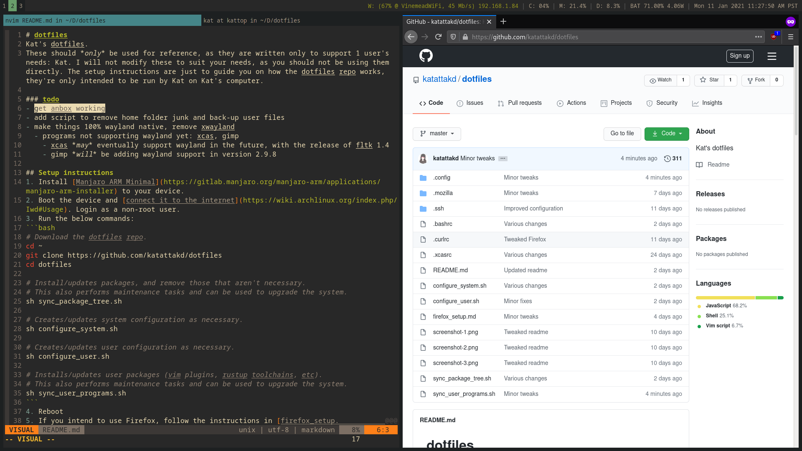

# dotfiles
Kat's dotfiles.
These should *only* be used for reference, as they are written only to support 1 user's needs: Kat. I will not modify these to suit your needs, as you should not be using them directly. The setup instructions are just to guide you on how the dotfiles repo works, they're only intended to be run by Kat on Kat's computer.

### todo
- clean up firefox user.js
- make things 100% wayland native, remove xwayland
  - programs not supporting wayland yet: xcas, gimp
    - xcas *may* eventually support wayland in the future, with the release of fltk 1.4
    - gimp *will* be adding wayland support in version 2.9.8

## Setup instructions (Partial install)
1. Install the following programs (or a subset of the following). Dependencies of configs are listed in nested form:
   - Alacritty (terminal emulator)
     - noto-fonts
   - Fish (CLI shell)
     - GNU Coreutils
     - man-db (Manual page tools)
     - Less (text pager)
     - Neovim (CLI code/text editor)
     - Exa (ls alternative)
     - Ncdu (du alternative)
     - Htop (top alternative)
     - Systemd (init system)
     - Optional deps:
       - ldns, fd, fff, gping, lazygit, ripgrep, github cli (Useful tools)
   - Rustup (Rust programming language)
     - Cargo-watch (automatically rebuilds Rust code)
     - GNU GCC
   - mpv (media player)
     - youtube-dl (streaming media downloader)
       - ffmpeg (media encoder)
     - noto-fonts
   - Firefox (web browser)
     - uBlock Origin (adblocker)
     - hunspell-en_us (spell checking dictionary)
   - xcas (computer algebra system)
   - gimp (image editor)
   - rawtherapee (raw image editor)
2. Run the following commands:
```bash
# Download the dotfiles repo.
cd ~
git clone https://github.com/katattakd/dotfiles
cd dotfiles

# Install/update configuration files
# Warn: This may interfere with other existing programs. Use with caution, and review the dotfiles repo before continuing.
ln -s ~/dotfiles/.config/* ~/.config
ln -s ~/dotfiles/.*rc ~/
ln -s ~/dotfiles/.ssh/* ~/.ssh

# Install/update Neovim plugins (if installed):
nvim -u ~/.config/nvim/init.vim -i NONE -c "PlugUpdate!" -c "PlugClean" -c "qa"

# Install/update Rustup toolchains (if installed):
rustup toolchain install stable
rustup toolchain install beta # Optional
rustup toolchain install nightly # Optional
rustup component add clippy

```
3. If you are using the fish shell, run the following commands:
```fish
# Review list of abbreviations, and remove those that are unnecessary/unneeded.
# This requires user intervention and cannot be automated
abbr # List abbrs
abbr -e $command # Remove abbr for $command (replace with the abbr you want removed)

# Remove confliting env variables
set # List env variables
set -eU $variable # Remove $variable (replace with the variable you want removed)

# WILL CAUSE ISSUES IF NOT REMOVED:
set -eU CARGO_HOME
set -eU RUSTUP_HOME

# Update Fish completions
fish_update_completions
```

## Update instructions (Partial install)
1. Update the installed packages through your distro's package manager
2. Run the following commands:
```bash
cd ~/dotfiles
git pull # Warn: This may result in broken symlinks, which will ned to be cleaned up manually.

# Update config files
# Warn: This may interfere with other existing programs. Use with caution, and review the dotfiles repo before continuing.
ln -s ~/dotfiles/.config/* ~/.config
ln -s ~/dotfiles/.*rc ~/
ln -s ~/dotfiles/.ssh/* ~/.ssh

# Update Neovim plugins (if installed):
nvim -u ~/.config/nvim/init.vim -i NONE -c "PlugUpdate!" -c "PlugClean" -c "qa"

# Update Rustup toolchains (if installed):
rustup update
```
3. Run the following commands in the Fish shell (if installed):
```fish
fish_update_completions
```

## Setup instructions (Full install)
1. Install [Manjaro ARM Minimal](https://manjaro.org/download/#pinebook-pro-minimal) to your device.
2. Boot the device and login as root.
3. Run the below commands (replace `$NON_ROOT_USER` with the account created during setup):
```bash
userdel -r $NON_ROOT_USER
homectl create kat --storage=luks --member-of=wheel --disk-size=16G
# If you want to put the /home on an SD card, replace --disk-size=16G with --image-path=/dev/mmcblk1
```
4. Login with the "kat" user. Connect the device to the internet using an Ethernet adapter or USB tethering.
5. Run the below commands:
```bash
# Download the dotfiles repo.
cd ~
git clone https://github.com/katattakd/dotfiles
cd dotfiles

# Install/updates packages, and remove those that aren't necessary.
# This also performs maintenance tasks and can be used to upgrade the system.
sh sync_package_tree.sh

# Creates/updates system configuration as necessary.
sh configure_system.sh

# Creates/updates user configuration as necessary.
sh configure_user.sh

# Installs/updates user packages (vim plugins, rustup toolchains, etc).
# This also performs maintenance tasks and can be used to upgrade the system.
sh sync_user_programs.sh
```
6. Reboot
7. Login to "kat" and run the below commands:
```bash
# Creates/updates user configuration as necessary.
# This requires an active window manager to run properly.
sh configure_user_additional.sh
```
8. Follow the instructions in [firefox_setup.md](firefox_setup.md). Most of Firefox's configuration is automated, however, adjusting extension settings must be done manually.

## Update intructions (Full install)

### System/user packages
To update installed packages on the configured system, run the following commands:
```bash
cd ~/dotfiles

# Update mirrorlist, so that packages will download faster. This should be run every few months or so.
sudo pacman-mirrors -f 0

# This will also mark any programs added manually for removal. To prevent this, create a ~/packages.txt file with the packages you want to keep.
sh sync_package_tree.sh

# This will also clean up junk from the home folder.
sh sync_user_programs.sh
```
### Configuration
To update the dotfiles on the configured system, run the following commands:
```bash
cd ~/dotfiles
git pull

sh sync_package_tree.sh
sh configure_system.sh
sh configure_user.sh
sh configure_user_additional.sh
sh sync_user_programs.sh
```

### Backups
Before backing up the installed system, export all extension settings to the cloud or to a file. This is documented in the [firefox_setup.md](firefox_setup.md) file.

Assuming all files are being properly managed by the repo's scripts, the following command should be sufficient to back up the installed system (replace `$DEST` with the location to back up to, like `kat@example.com:/home/kat/kattop_backup`):
```bash
sh backup.sh $DEST
```

## Screenshots
  
