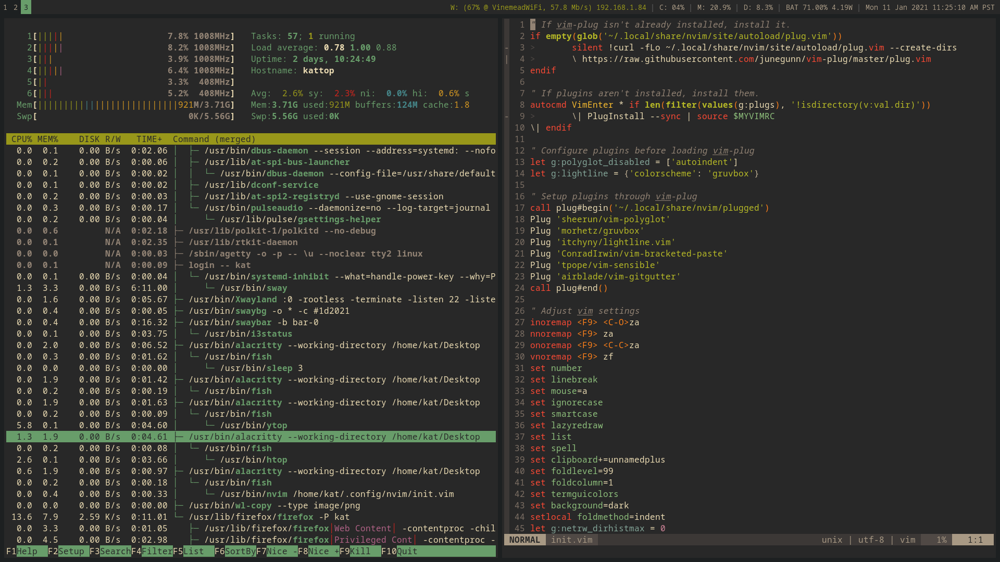

# dotfiles
Kat's dotfiles.
These should *only* be used for reference, as they are written only to support 1 user's needs: Kat. I will not modify these to suit your needs, as you should not be using them directly. The setup instructions are just to guide you on how the dotfiles repo works, they're only intended to be run by Kat on Kat's computer.

# todo
- move back to x86_64 (aarch64 linux is hell)
  - fully automate system installation process
  - use firefox flatpak
  - remove device specific configuration

## Setup/update instructions (Partial install)
1. Install the following programs (or a subset of the following). Dependencies of configs are listed in nested form:
   - Alacritty (terminal emulator)
     - noto-fonts
     - Fish (CLI shell)
       - GNU Coreutils
       - man-db (Manual page tools)
       - Less (text pager)
       - Neovim (CLI code/text editor)
       - Exa (ls alternative)
       - Ncdu (du alternative)
       - Htop (top alternative)
       - Optional deps:
         - ldns, fd, gping, lazygit, ripgrep, github cli (Useful tools)
   - Rust (Rust programming language)
     - Cargo-watch (automatically rebuilds Rust code)
   - mpv (media player)
     - youtube-dl (streaming media downloader)
       - ffmpeg (media encoder)
     - noto-fonts
   - Firefox (web browser)
     - uBlock Origin (adblocker)
     - hunspell-en_us (spell checking dictionary)

   Note: Updates will need to be handled by your distro's package manager, and should be performed often.
2. Run the following commands:
```bash
# Download the dotfiles repo.
cd ~
git clone https://github.com/katattakd/dotfiles
cd dotfiles
# If you're only updating the repo, do `cd ~/dotfiles && git pull` instead!

# Install/update configuration files and managed programs
# Warn: This may interfere with other existing programs on your device. Use with caution, and review the repo's contents before continuing.
sh partial_user_sync_configure.sh

# Note: Updating the dotfiles may leave broken symlinks on your system, which will need to be removed manually.
```

## Setup instructions (Full install)
1. Install [Manjaro ARM Minimal](https://manjaro.org/download/#pinebook-pro-minimal) to your device.
2. Boot the device and login as root.
3. Run the below commands (replace `$NON_ROOT_USER` with the account created during setup):
```bash
# Remove old user
userdel -r $NON_ROOT_USER

# Enable fscrypt
sudo tune2fs -O encrypt $(df -P / | tail -1 | cut -d' ' -f 1)

# Create new user with encrypted home directory
homectl create kat --member-of=wheel --storage=fscrypt
```
4. Login with the "kat" user. Connect the device to the internet using an Ethernet adapter or USB tethering.
5. Run the below commands:
```bash
# Download the dotfiles repo.
cd ~
git clone https://github.com/katattakd/dotfiles
cd dotfiles

# Configures Pinebook Pro / Manjaro (ARM) specific parts of the system.
# This must be run before all other scripts.
sh configure_system_pbp.sh

# Install/updates packages, and remove those that aren't necessary.
# This also performs maintenance tasks and can be used to upgrade the system.
sh sync_package_tree.sh

# Creates/updates system configuration as necessary.
sh configure_system.sh

# Creates/updates user configuration as necessary.
sh configure_user.sh

# Installs/updates user packages (vim plugins, rustup toolchains, etc).
# This also performs maintenance tasks and can be used to upgrade the system.
sh sync_user_programs.sh
```
6. Reboot
7. Login to "kat" and run the below commands:
```bash
# Creates/updates user configuration as necessary.
# This requires an active window manager to run properly.
sh configure_user_additional.sh
```
8. Follow the instructions in [firefox_setup.md](firefox_setup.md). Most of Firefox's configuration is automated, however, adjusting extension settings must be done manually.

## Update intructions (Full install)

### System/user packages
To update installed packages on the configured system, run the following commands:
```bash
cd ~/dotfiles

# This will also mark any programs added manually for removal. To prevent this, create a ~/packages.txt file with the packages you want to keep.
sh sync_package_tree.sh

# This will also clean up junk from the home folder.
sh sync_user_programs.sh
```
### Configuration
To update the dotfiles on the configured system, run the following commands:
```bash
cd ~/dotfiles
git pull

sh sync_package_tree.sh
sh configure_system.sh
sh configure_user.sh
sh configure_user_additional.sh
sh sync_user_programs.sh
```

### Backups
Before backing up the installed system, export all extension settings to the cloud or to a file. This is documented in the [firefox_setup.md](firefox_setup.md) file.

Assuming all files are being properly managed by the repo's scripts, the following command should be sufficient to back up the installed system (replace `$DEST` with the location to back up to, like `kat@example.com:/home/kat/kattop_backup`):
```bash
sh backup.sh $DEST
```

## Screenshots
  
